# Presentation

## Data Gathering, Cleaning and Organizing
Below are the steps used by our team to gather and prepare the data for analysis.

__Scraping:__ Use of the python module BeautifulSoup4 to scrape from Payscale to gather the salary data for Data Scientists across the US.

__Regional Data:__ Gather data on the cities that match up with cities that have DS salary data as well as cities within 100km from (~60mi) from those city centers.

__Machine Learning:__ fit a linear regression classifier to multiple features in order to build a model that effectively determined the missing cost of living values with an R-squared value of 96.1319 %.

__Normalizing:__ The data returned from numbeo’s API was primarily normalized to New York prices. We decided to modify this default benchmark so that our target audience, our beloved cohort, will better understand it. To do this we modified the data to use Los Angeles as the benchmark.

__Converting:__ Using Numbeo’s built-in app we created profiles for a “single Data Scientist” and a “Data Scientist with a family of four”. With those profiles we converted our normalized data into monetary values.

## Profiles
In order to give value to the normalized data we decided to create two seperate profiles that would define what we mean by a "Single Data Scientist" and a "Family Data Scientist".

| __Profile Questions__ | __Single DS__ | __Family DS__ |
|-----------------------|---------------|---------------|
|1).Members of your household:|1|4|
|2).Eating lunch or dinner in restaurants:|50% of the time|25% of the time|
|3).When eating in restaurants you are choosing inexpensive restaurants:|80% of the time|30% of the time|
|4).Drinking Coffee outside of your home:|High|High|
|5).Going out (cinema, nightlife, etc.):|once per week per household member|twice per month per household member|
|6).Smoking (household overall):|0 packs of cigarettes per day|0 packs of cigarettes per day|
|7).Alcoholic beverages (consume):|Moderate|Low|
|8).At home we are eating:|Western food|Western food|
|9).Driving car:|Moderate|Moderate|
|10).Taking Taxi:|No|No|
|11).Paying for public transport tickets:|None|None|
|12).Sport Memberships:|No|2 Household members|
|13).Vacation and Travel:|Two per year(one week each), relatively expensive|Once per year(one week each), relatively expensive|
|14).Buying Clothing and Shoes:|Moderate|Moderate|

## Data Analysis: Data Overview
After scraping data from Payscale that describes the median salary for Data Scientists across the US we sorted it to show the top top cities. The Geographical graph below visually represents that data.

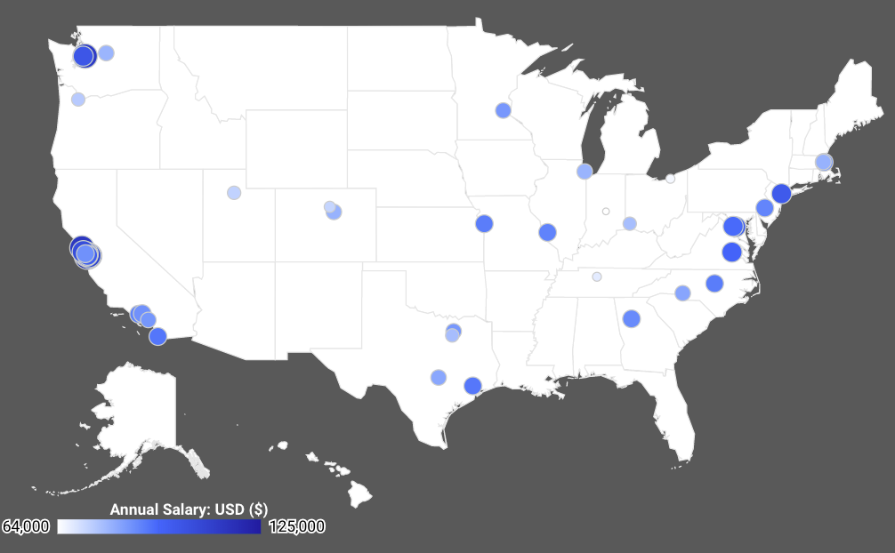

## Data Analysis: Top Ten Cities for a Data Scientist
The charts below indicate the top 10 cities for either a single Data Scientist or a Data Scientist with a family of four based off of this equation:
`profit margin = median salary/month - (mean of nearby cities(cpi) + mean of nearby cities(rent))`

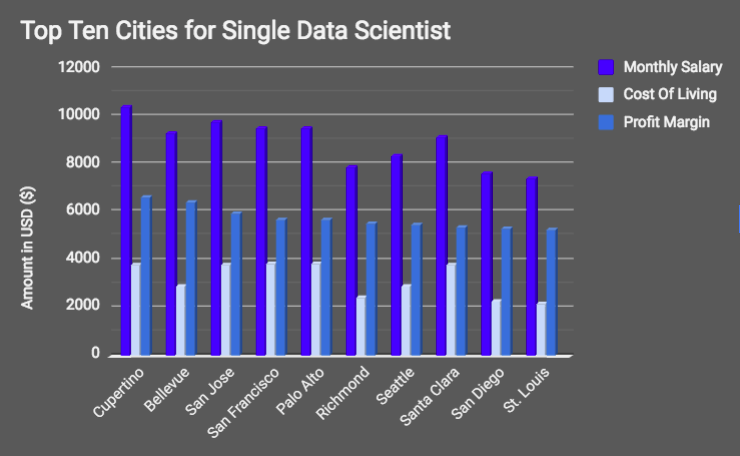
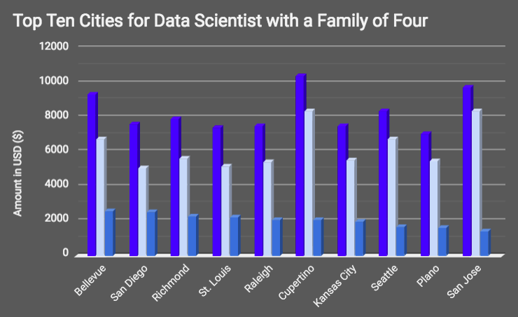

## Data Analysis: Top Three Cities for a Single Data Scientist
The following charts shown below indicate the difference between cost of living prices, salaries, and quality of life factors, which are based off of non-monetary elements such as pollution, and health care, compared to those of Los Angeles.
\*Note that we are using the __Single DS__ profile values defined earlier for this analysis.

### City # 3: San Jose, CA
| Cost of Living Element | San Jose Price |
|------------------------|----------------|
| Restaurant | $660 |
| Groceries | $267 |
| Rent | $1,920 |
| DS Salary/Mo | $9,759 |
| Net Living | $5,959 |

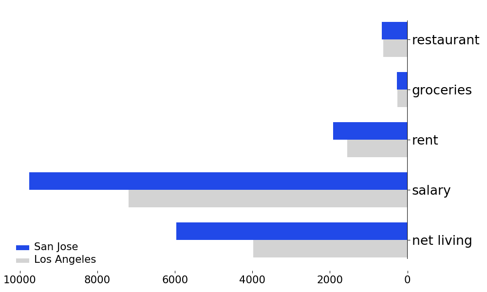
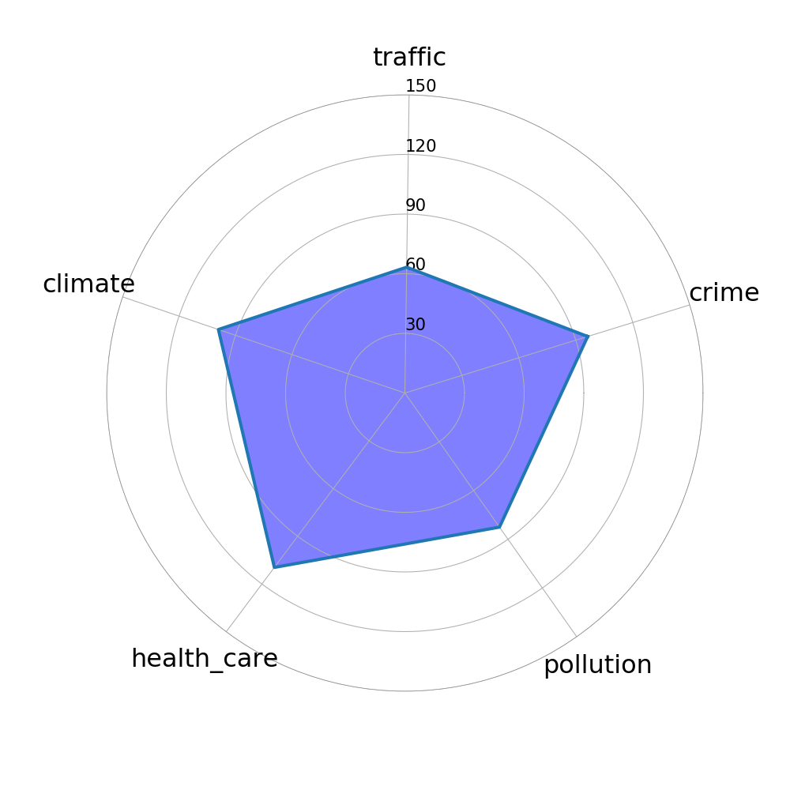
### City # 2: Bellevue, WA
| Cost of Living Element | Bellevue Price |
|------------------------|----------------|
| Restaurant | $624 |
| Groceries | $259 |
| Rent | $1,110 |
| DS Salary/Mo | $9,331 |
| Net Living | $6,433 |

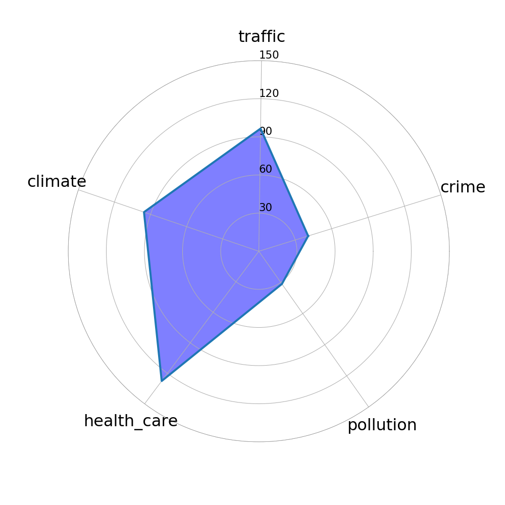
### City # 1: Cupertino, CA
| Cost of Living Element | Cupertino Price |
|------------------------|-----------------|
| Restaurant | $660 |
| Groceries | $267 |
| Rent | $1,920 |
| DS Salary/Mo | $10,417 |
| Net Living | $6,616 |

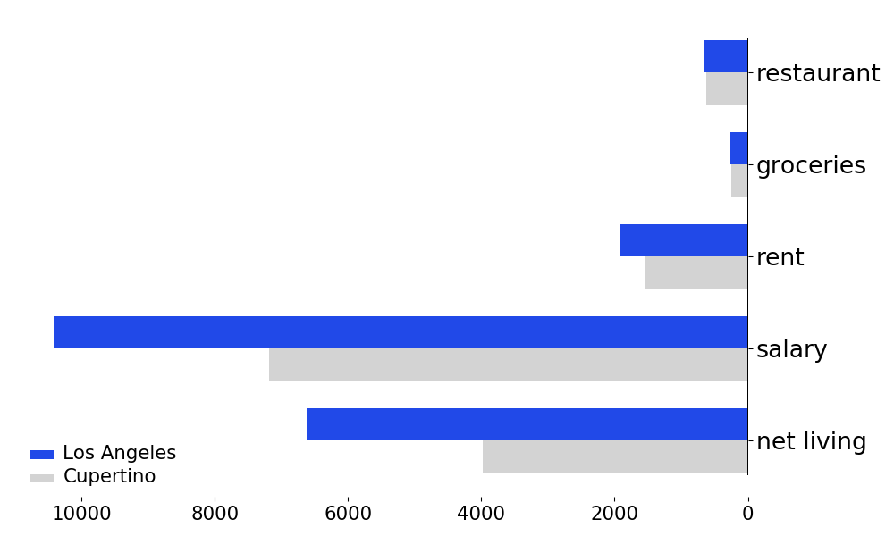
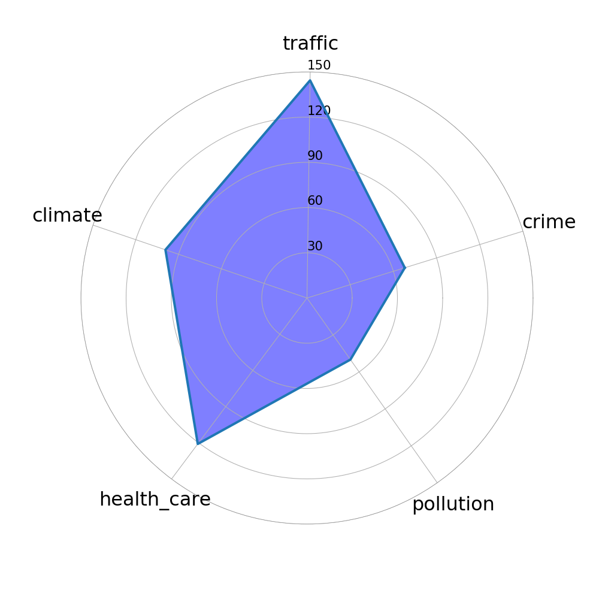

## Data Analysis: Top Three Cities for a Data Scientist w/a Family
The following charts shown below indicate the difference between cost of living prices, salaries, and quality of life factors, which are based off of non-monetary elements such as pollution, and health care, compared to those of Los Angeles.
\*Note that we are using the __Family DS__ profile values defined earlier for this analysis.

### City # 3: Richmond, VA
| Cost of Living Element | Richmond Price |
|------------------------|----------------|
| Restaurant | $1,690 |
| Groceries | $1,078 |
| Rent | $1,515 |
| DS Salary/Mo | $7,917 |
| Net Living | $2,270 |

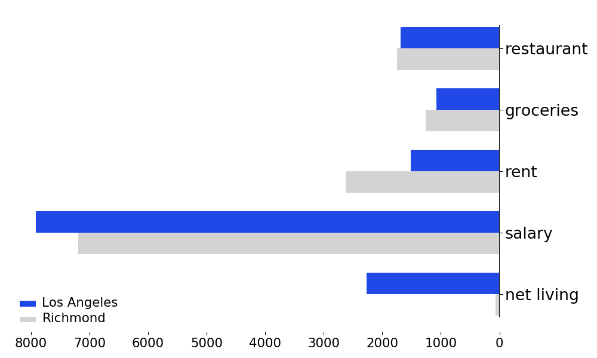
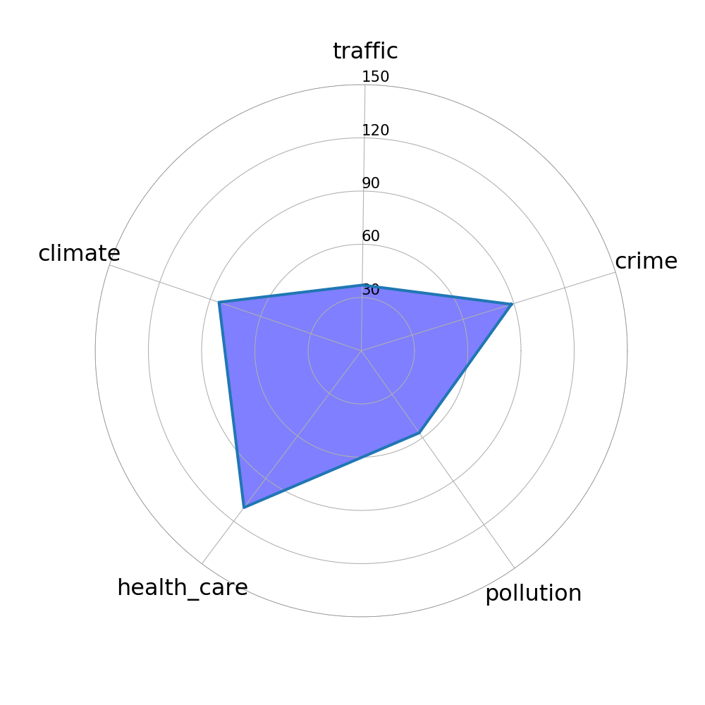
### City # 2: San Diego, CA
| Cost of Living Element | San Diego Price |
|------------------------|-----------------|
| Restaurant | $1,633 |
| Groceries | $1,016 |
| Rent | $1,875 |
| DS Salary/Mo | $7,610 |
| Net Living | $2,522 |

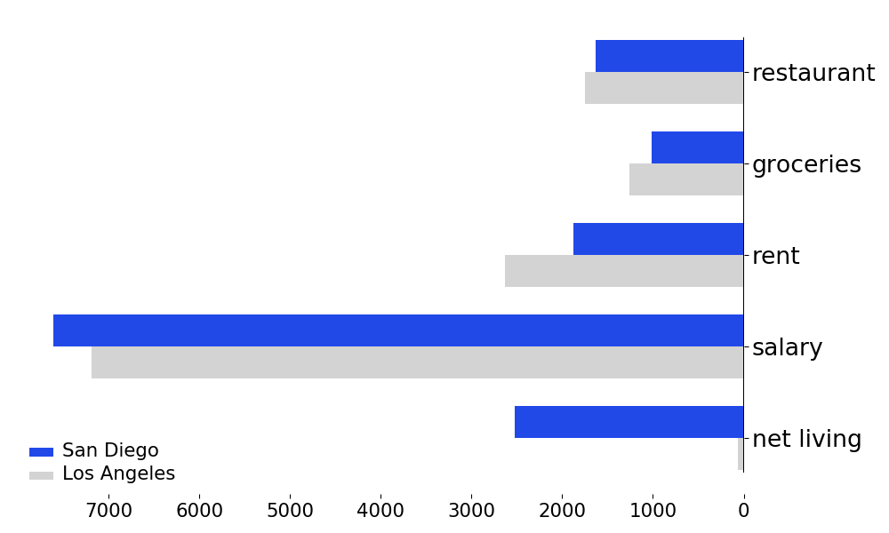
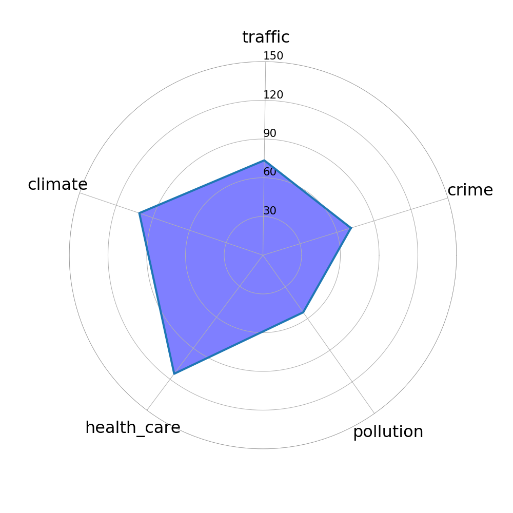
### City # 1: Bellevue, CA
| Cost of Living Element | Bellevue Price |
|------------------------|----------------|
| Restaurant | $1,755 |
| Groceries | $1,294 |
| Rent | $1,878 |
| DS Salary/Mo | $9,331 |
| Net Living | $2,586 |

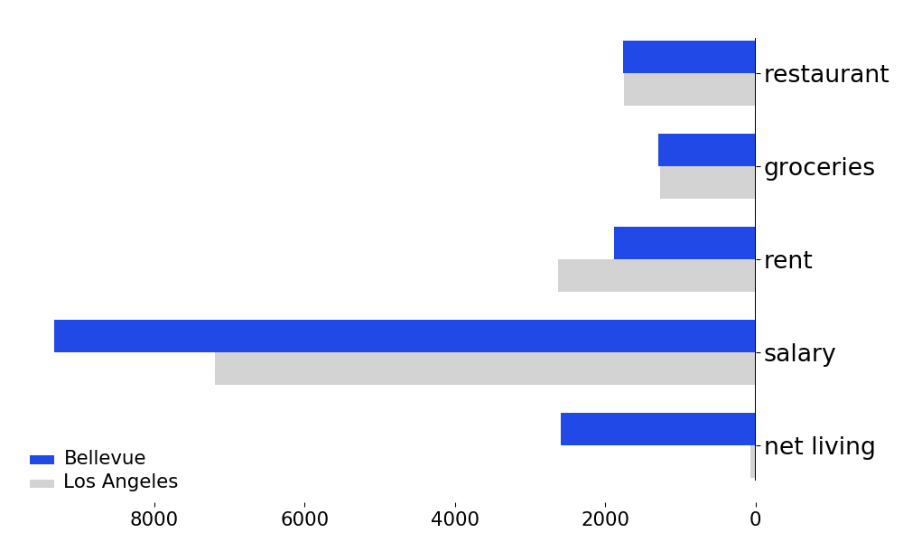

